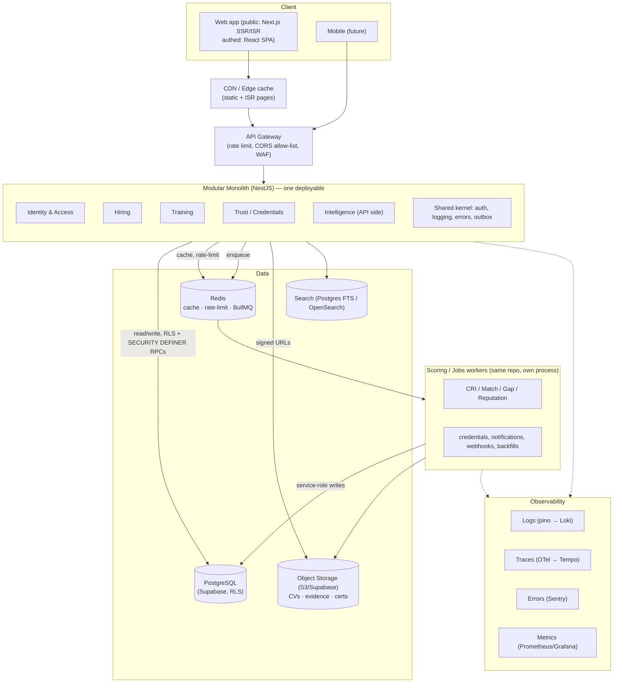
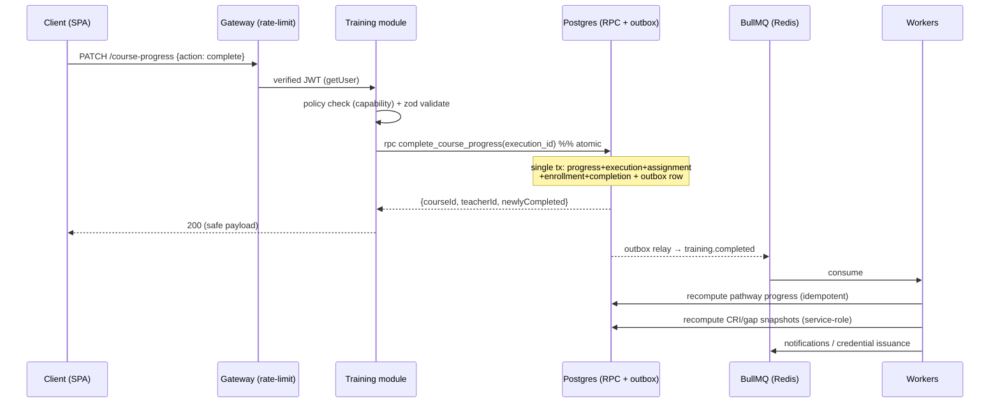

# EduLink — Target Architecture

Goal: take a Lovable SPA + Supabase-edge codebase to a production-grade,
scalable, observable system **without a rewrite**. Keep what is load-bearing
(Postgres, Auth, RLS, the React app), fix the trust boundary, and give the
domain a real home.

---

## 1. Style decision — Modular Monolith (not microservices)

**Decision: a Modular Monolith on TypeScript (NestJS or Fastify + a modules/
convention), with Supabase as the managed data/auth/storage platform.**

### Why not microservices
- **One team, one product, one database.** The bounded contexts (Identity,
  Hiring, Training, Trust, Intelligence) are real, but they share the same
  Postgres and are joined constantly (a match reads teacher + job + skills +
  snapshots). Splitting them into services turns in-process calls and SQL joins
  into network hops and distributed transactions — the exact problem this
  codebase already has at the edge (issue #3: no atomicity) made worse.
- **No independent scaling need yet.** Snapshot tables hold 0–4 rows
  (`.lovable/plan.md`). There is no traffic profile that justifies per-service
  scaling. Microservices would add ops cost (deploy, discovery, tracing,
  versioned contracts) with zero current payoff.
- **The seams already exist in code** (`src/contracts/*`, `src/intelligence/*`).
  A modular monolith enforces those seams as module boundaries with explicit
  public APIs — you get DDD isolation and a clean split path *later* if one
  context (e.g. Intelligence scoring) genuinely needs to scale out.

### The one thing that *does* split out
**Intelligence scoring workers** run as separate processes (same codebase,
different entrypoint) consuming a queue. Scoring is CPU-bound, bursty, and must
be off the request path and off the client (issue #4). This is a worker, not a
microservice — no separate DB, no network contract.

```
Modular Monolith (one deployable API) ──► Postgres (Supabase)
        │                                      ▲
        └── emits jobs ──► Redis/BullMQ ──► Scoring Workers (same repo, own process)
```

---

## 2. Target topology



---

## 3. Component decisions

### Authentication & Authorization
- **AuthN:** Supabase Auth (JWT). **Verify server-side** via `getUser()` / JWKS —
  never hand-decode (fixes audit #2). The client never holds `service_role`.
- **AuthZ, three layers (defense in depth):**
  1. **Route/policy layer** in the monolith — a capability check mirroring the
     existing model (`Access = Auth + Role + Membership/Persona + Entitlement`,
     `docs/access-model.md`). Implement with CASL or a small policy module keyed
     on `user_roles` + `account_entitlements` + `organization_entitlements`.
  2. **RLS** on every table as the backstop — *tested* with pgTAP (fixes #6).
  3. **SECURITY DEFINER RPCs** keyed on `auth.uid()` for privileged multi-writes,
     so no service-role key is needed on the request path (see the delivered
     `complete_course_progress`).
- **Principle:** branch on capability/entitlement, never on role/type literals —
  already the codebase's intent; the policy layer makes it the only path.

### Redis — where and why
| Use | Why |
|---|---|
| **Read cache** for intelligence snapshots, exposure results, taxonomy | scoring is expensive; snapshots are read-heavy, write-rare → cache with pub/sub invalidation on write |
| **Rate limiting** (token bucket) | fixes audit #13 — contact-reveal, talent-search, auth-adjacent |
| **BullMQ backend** | job/queue durability |
| **Ephemeral locks / idempotency keys** | dedupe retried mutations (audit #17) |
| **Session-adjacent hot data** | resolved capabilities per user, short TTL |

### Queues (BullMQ on Redis) — where
- **Intelligence pipeline:** domain event → queue → scoring worker → snapshot
  write. This is the fix for audit #4 (scoring leaves the browser). The existing
  "Smart Glue" event names become queue topics.
- **Credential issuance**, **notifications/email**, **third-party booking/verify
  webhooks**, **backfills/recompute**. All with bounded retries + backoff and a
  **dead-letter queue** with alerting.
- Delivery guarantee via a **transactional outbox** (events written in the same
  DB transaction as the state change; a relay drains the outbox to the queue) —
  so events can't be lost on client failure (fixes audit #12's client-side
  emission).

### Background jobs (scheduled)
- Snapshot **freshness sweep** (recompute stale scores; `docs/architecture/
  intelligence-freshness-policy.md` already defines the policy — enforce it in a
  cron worker, not on read).
- **Payout runs**, **compliance checks**, **saved-search alerts**, **data-audit
  runners** (the `src/admin/audit/*` utilities become scheduled jobs).
- Runner: BullMQ repeatable jobs or pg_cron for DB-local sweeps.

### File storage
- **Supabase Storage (S3-compatible)** — private buckets: `cvs`, `evidence`,
  `certificates`.
- **Access:** bucket RLS scoped to owner + entitled viewer; short-TTL **signed
  URLs** minted by the monolith after a policy check; every reveal logged
  (`contact_reveal_audit` already exists — wire it to storage access too).
- **Ingest:** type/size validation, checksum, async **virus scan** job before
  the object is marked usable. Fixes audit #11.

### Performance & bottleneck prevention
- **Scoring off the request path** (workers) + **cached snapshots** (Redis) —
  removes the single biggest hot-path cost and the client-compute anti-pattern.
- **Atomic RPCs** for multi-write use cases — fewer round-trips, no partial
  state (audit #3).
- **Search:** start with Postgres FTS + trigram (40+ indexes already exist);
  graduate the talent/job search to OpenSearch only when FTS p95 degrades.
- **Read replicas** for search/analytics once traffic warrants; keep writes on
  primary.
- **N+1 discipline:** batch fetch (the code already does this in places —
  `course-progress` GET batches titles/assignments); enforce via query budget
  logging (`trackQueryPerf` exists — surface it as a metric).
- **CDN + SSR/ISR** for public pages (audit #16).

### Logging, Monitoring, Error handling
- **Structured JSON logs** (pino) with request id + user id + trace id; ship to
  Loki. Stop `console.*` and stop swallowing errors (audit #7).
- **Tracing:** OpenTelemetry spans across gateway → monolith → DB → worker.
- **Errors:** Sentry; **typed error hierarchy** → safe client messages + stable
  machine codes, internal detail logged only (audit #8; implemented for
  `course-progress`).
- **Metrics:** Prometheus (RED: rate/errors/duration per endpoint + queue depth,
  DLQ size, snapshot freshness lag) → Grafana + alerts.
- **Async safety:** dead-letter queues, bounded retries with jittered backoff,
  idempotency keys.

---

## 4. Request & event flow (course completion, target state)



Contrast with today: all of that runs inline in a 512-LOC edge handler plus the
browser hook, non-atomically, with client-side event emission and scoring.

---

## 5. Migration path (incremental, no big-bang)

1. **Stand up the monolith shell** (NestJS) in front of Supabase; move one module
   (Training — done here as the pattern) behind it. Edge functions keep working
   during transition.
2. **Introduce Redis + BullMQ + outbox**; move intelligence scoring to a worker;
   flip snapshot tables to service-role-write.
3. **Add CI, one lockfile, strict TS, RLS tests** (the safety floor — audit
   #1/#6/#9/#10).
4. **SSR the public surface** (Next.js) for SEO.
5. **Collapse the over-built intelligence layers** (audit #14) behind flags as
   real usage data arrives.

Each step is shippable and reversible on its own.
